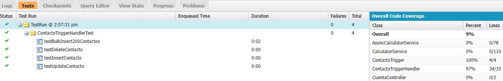
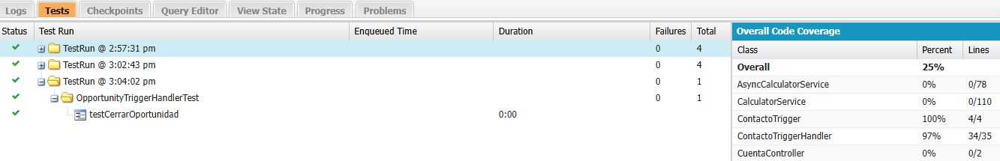
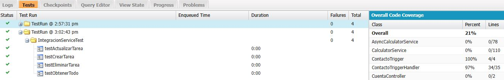
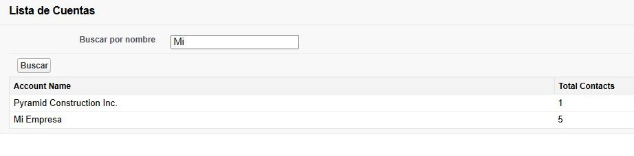
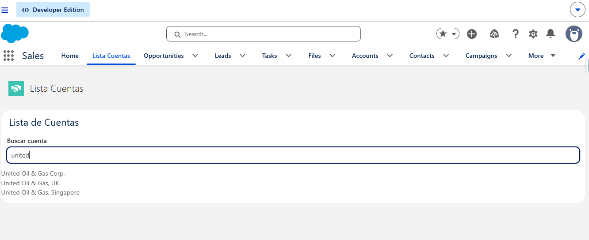

# salesforce-dev-portfolio — Proyecto de Práctica

**Rafael Franco Moreno** · [LinkedIn](https://www.linkedin.com/in/rafael-franco-moreno/) · Salesforce Developer & Administrator

Proyecto Salesforce (SFDX) con ejercicios reales de desarrollo: triggers bulkificados, procesos asíncronos, integraciones REST/SOAP, Flow, Visualforce y modelado de datos avanzado.

## 🚀 Features

### Trigger de conteo de contactos
- `ContactoTrigger` + `ContactoTriggerHandler`
- Mantiene actualizado el campo `Total_Contacts__c` en `Account` ante `insert`, `update` (incluye cambio de cuenta) y `delete`
- Bulkificado: sin SOQL/DML dentro de loops
- 96%+ de cobertura, incluye test de volumen (200 registros) para validar Governor Limits



### Trigger de seguimiento post-venta
- `OpportunityTrigger` + `OpportunityTriggerHandler`
- Al detectar que una Opportunity cambia a `Closed Won` (comparando `Trigger.new` contra `Trigger.oldMap`), crea automáticamente una `Task` de seguimiento post-venta asignada al owner, con fecha 7 días después
- Bulkificado: filtra las oportunidades relevantes primero, crea todas las tareas en un solo `insert`



### Procesos asíncronos
- `RecalcularConteoContactosBatch` — Batch Apex para recorrer y corregir el conteo en toda la org
- `NotificarCambioQueueable` — Queueable Apex de ejemplo para procesamiento en segundo plano

### Integraciones
- `IntegracionService` + `MockHttpService` — integración REST (GET/POST) probada con `HttpCalloutMock`, sin depender de la API real en los tests
- Uso de Named Credentials para manejar endpoints externos de forma segura
- Integración SOAP contra un servicio externo (WSDL) vía clases generadas por Salesforce



### Visualforce
- `ListaCuentas` + `ListaCuentasController` — listado de cuentas con buscador AJAX (`reRender`, sin recargar página)



### Lightning Web Components

- `listaCuentas` — componente LWC consumiendo datos de Apex con `@wire`, incluyendo manejo de `{ data, error }`



### Modelado de datos
- `Factura__c` — relación Master-Detail con `Account`, con Roll-Up Summary
- `Inscripcion__c` — Junction Object (Master-Detail x2) resolviendo relación muchos-a-muchos entre `Contact` y `Curso__c`

## 🛠️ Stack técnico
- Apex (clases, triggers, batch, queueable, test classes, Mock HTTP)
- Lightning Web Components (`@wire`)
- Visualforce
- SOQL / SOSL
- REST (GET/POST) / SOAP callouts, Named Credentials
- Salesforce Flow
- Salesforce CLI + Git

## 📁 Estructura
```
force-app/main/default/
├── classes/       # Apex classes, handlers, batch, queueable, tests, mocks
├── triggers/       # ContactoTrigger, OpportunityTrigger
├── lwc/             # Componentes Lightning Web Components
├── pages/          # Visualforce
├── objects/        # Objetos custom (Factura__c, Curso__c, Inscripcion__c)
docs/img/            # Capturas de pantalla usadas en este README
```

## ⚙️ Cómo desplegar
```bash
sf project deploy start --source-dir force-app
```

Correr los tests:
```bash
sf project deploy start --source-dir force-app --test-level RunLocalTests
```

## 📌 Sobre este proyecto
Repositorio de práctica para reforzar desarrollo Salesforce end-to-end: desde triggers bulkificados hasta integraciones externas y modelado de datos, con control de versiones vía Git desde el primer commit.
